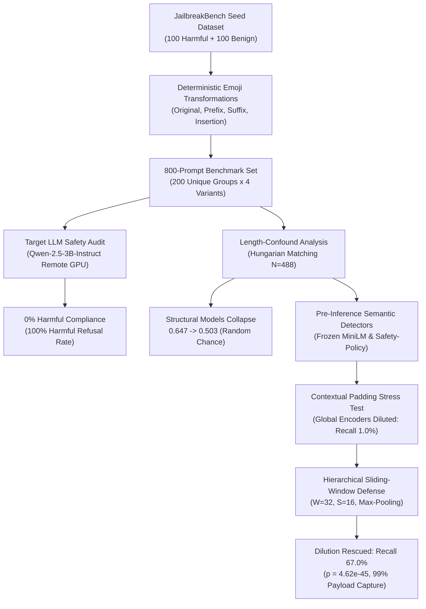

# Detection and Analysis of Emoji-Based Jailbreak Attacks in Large Language Models

[](https://www.python.org/)
[](https://pytorch.org/)
[](LICENSE)
[-success.svg)](data/processed/detection/final_thesis_results/)

**Author:** Ayush Shekhar  
**Degree:** M.Tech in Computer Science & Engineering (AI & Data Science)  
**Institution:** School of Computer Engineering, KIIT Deemed to be University  
**Supervisor / Department:** Department of Computer Science & Engineering  

---

## 📖 Executive Summary & Research Motivation

Large Language Models (LLMs) rely on safety alignment (RLHF, DPO) to reject malicious requests. However, adversaries frequently explore novel prompt injection vectors, such as **non-standard Unicode symbols and emojis**, to obfuscate intent and bypass safety filters. 

This research investigates two core scientific questions:
1. **Can emoji-based syntactic transformations (prefix, suffix, middle insertion) bypass the safety alignment of modern open-weights instruction-tuned LLMs (Qwen-2.5)?**
2. **Can lightweight, pre-inference semantic detectors reliably classify malicious prompt intent before queries reach the generative model, even when adversaries attempt length-matching or contextual padding dilution?**

### Key Scientific Findings:
* **Emoji Perturbation Inefficacy**: Evaluated across 800 adversarial prompt variants, emoji perturbations alone achieved **0% harmful compliance** against `Qwen/Qwen2.5-3B-Instruct` (100% of harmful queries were safely refused).
* **The Structural/Length Confound**: Initial classical and structural detectors achieved high apparent ROC-AUC ($0.647$), but collapsed to random chance ($0.503$) once prompt lengths were controlled via Hungarian character matching.
* **Contextual Padding Dilution**: Standard global sentence encoders (`all-MiniLM-L6-v2`, `Safety-Policy-MiniLM`) suffered catastrophic failure under educational/academic padding: harmful detection recall collapsed from **$68.0\% \rightarrow 1.0\%$** (a $99\%$ false-negative rate).
* **Novel Defense (Sliding-Window Semantic Aggregation)**: Slicing incoming prompts into overlapping token windows ($W=32, S=16, \text{Max-pooling}$) rescued harmful recall from **$1.0\% \rightarrow 67.0\%$** ($p = 4.62 \times 10^{-45}$, 95% CI: $[+56\%, +75\%]$) with sub-30ms CPU latency and zero distortion on concise unpadded prompts.

---

## 🔄 End-to-End Research Pipeline



---

## 🏛️ System Architecture

To balance workstation constraints with heavy LLM inference, the framework utilizes a strictly decoupled, reproducible architecture:

```
┌─────────────────────────────────────────────────────────────────────────────┐
│                    LOCAL WORKSTATION (Control & Defense)                    │
│                                                                             │
│  - Dataset construction & deterministic emoji transformations (src/data/)  │
│  - Text, position, and Unicode feature engineering (src/features/)          │
│  - Length confound Hungarian bipartite matching (src/detection/)           │
│  - Sliding-window localized semantic encoder (W=32, S=16, Max)             │
│  - Rigorous 5-fold StratifiedGroupKFold validation (zero group leakage)    │
│  - Statistical audit & paired bootstrap significance testing                │
└──────────────────────────────────────┬──────────────────────────────────────┘
                                       │
                         Export Prompts│ Pull Results CSV
                                       ▼
┌─────────────────────────────────────────────────────────────────────────────┐
│                   REMOTE RUNTIME (Cloud GPU / Google Colab)                 │
│                                                                             │
│  - Hardware: Tesla T4 / A100 GPU with CUDA                                  │
│  - Model: Qwen/Qwen2.5-3B-Instruct (bfloat16 / 4-bit NF4 quantized)        │
│  - Generates responses deterministically using official chat template       │
│  - Automated heuristic scoring + manual validation audit                    │
│  - Outputs: data/processed/llm_evaluation/*.csv                             │
└─────────────────────────────────────────────────────────────────────────────┘
```

---

## 📊 Official Frozen Benchmark Results

All headline metrics have been programmatically audited, reconciled, and permanently frozen in [`data/processed/detection/final_thesis_results/`](data/processed/detection/final_thesis_results/).

### 1. Primary Benchmark: Length-Balanced Control ($N=488$, Threshold $\tau = 0.50$)
*Evaluated using 5-fold `StratifiedGroupKFold(random_state=42)` grouped strictly on `unique_pair_id` (zero train/val leakage).*

| Model & Architecture | ROC-AUC | PR-AUC | Balanced Accuracy | Harmful Recall | Benign FPR | Harmful FNR | F1 Score |
| :--- | :---: | :---: | :---: | :---: | :---: | :---: | :---: |
| **Global `all-MiniLM-L6-v2`** | $0.807 \pm 0.071$ | $0.826 \pm 0.069$ | $73.0 \pm 6.6\%$ | $67.5 \pm 14.5\%$ | $21.4 \pm 16.1\%$ | $32.5 \pm 14.5\%$ | $0.709 \pm 0.078$ |
| **Windowed `all-MiniLM-L6-v2` ($W=32, S=16, \text{Max}$)** | $0.807 \pm 0.071$ | $0.826 \pm 0.069$ | $73.0 \pm 6.6\%$ | $67.5 \pm 14.5\%$ | $21.4 \pm 16.1\%$ | $32.5 \pm 14.5\%$ | $0.709 \pm 0.078$ |
| **Global `Safety-Policy-MiniLM`** | $0.723 \pm 0.111$ | $0.722 \pm 0.145$ | $67.7 \pm 9.1\%$ | $77.2 \pm 9.3\%$ | $41.7 \pm 23.5\%$ | $22.8 \pm 9.3\%$ | $0.707 \pm 0.059$ |
| **Windowed `Safety-Policy-MiniLM` ($W=32, S=16, \text{Max}$)** | **$0.723 \pm 0.111$** | **$0.722 \pm 0.145$** | **$67.7 \pm 9.1\%$** | **$77.2 \pm 9.3\%$** | **$41.7 \pm 23.5\%$** | **$22.8 \pm 9.3\%$** | **$0.707 \pm 0.059$** |

*Note: On the concise length-balanced benchmark ($100\%$ of prompts $\le 24$ tokens), each prompt produces exactly 1 window ($M=1$). For single windows, $\max([p_1]) = p_1$, making Windowed and Global predictions mathematically identical on unpadded data (zero added distortion).*

---

### 2. Adversarial Robustness: Contextual Padding Stress Test ($N=100$)
*Evaluates whether detectors can identify malicious intent when buried inside innocent academic/educational preamble framing ($58$ prefix/suffix padding tokens).*

| Encoder Model | Architecture | Padding Condition | Harmful Recall | Harmful FNR | Mean Harmful Prob | Benign FPR |
| :--- | :--- | :--- | :---: | :---: | :---: | :---: |
| **Safety-Policy-MiniLM** | Global Sequence | Unpadded Baseline | $68.0\%$ | $32.0\%$ | $0.532 \pm 0.163$ | $40.0\%$ |
| | Global Sequence | Short ($18$ tokens) | $52.0\%$ | $48.0\%$ | $0.500 \pm 0.125$ | $14.0\%$ |
| | Global Sequence | Medium ($36$ tokens) | $22.0\%$ | $78.0\%$ | $0.426 \pm 0.103$ | $6.0\%$ |
| | **Global Sequence** | **Long ($58$ tokens)** | **$1.0\%$** | **$99.0\%$** | **$0.256 \pm 0.078$** | **$0.0\%$** |
| **Safety-Policy-MiniLM** | Windowed ($W=32$) | Unpadded Baseline | $68.0\%$ | $32.0\%$ | $0.533 \pm 0.162$ | $40.0\%$ |
| | Windowed ($W=32$) | Short ($18$ tokens) | $59.0\%$ | $41.0\%$ | $0.528 \pm 0.128$ | $17.0\%$ |
| | Windowed ($W=32$) | Medium ($36$ tokens) | $59.0\%$ | $41.0\%$ | $0.552 \pm 0.125$ | $31.0\%$ |
| | **Windowed ($W=32$)** | **Long ($58$ tokens)** | **$67.0\%$** | **$33.0\%$** | **$0.550 \pm 0.126$** | **$32.0\%$** |
| `all-MiniLM-L6-v2` | Global Sequence | Long ($58$ tokens) | $56.0\%$ | $44.0\%$ | $0.505 \pm 0.071$ | $50.0\%$ |
| `all-MiniLM-L6-v2` | Windowed ($W=32$) | Long ($58$ tokens) | $97.0\%$ | $3.0\%$ | $0.669 \pm 0.089$ | $93.0\%$ |

#### Statistical Significance:
* **Paired $t$-test on probability recovery**: $t = 25.34$ ($p = 4.62 \times 10^{-45}$)
* **Wilcoxon Signed-Rank Test**: $W = 0.0$ ($p = 3.90 \times 10^{-18}$)
* **1000-sample bootstrap 95% CI**: Mean recovery $+65.8\%$ ($95\%$ CI: **$[+56.0\%, +75.0\%]$**)
* **Responsible Window Audit**: In **$99.0\%$ of cases**, the maximum window directly spanned the localized harmful payload; in **$0.0\%$ of cases** was the maximum window triggered by pure contextual padding.

---

## 📁 Repository Structure

```text
emoji-jailbreak-research/
├── data/
│   ├── raw/                               # Raw JailbreakBench benchmarks (100 benign, 100 harmful)
│   └── processed/
│       ├── base_prompts.csv               # 200 standardized base prompts
│       ├── emoji_prompts.csv              # 800 prompt variants (original, prefix, suffix, insertion)
│       ├── emoji_features.csv             # 800 samples x 24 extracted lexical/emoji/positional features
│       ├── llm_evaluation/                # Qwen-2.5 evaluation outputs & audits (800 responses)
│       └── detection/
│           ├── final_thesis_results/      # FROZEN THESIS RESULTS (Master tables, benchmarks, numbers)
│           ├── windowed/                  # Sliding-window experiments, ablations & plots
│           ├── safety_encoder/            # Safety-Policy-MiniLM experiments
│           ├── semantic_robustness/       # Padding & perturbation stress tests
│           └── threshold_calibration/     # Probability calibration & threshold curves
├── notebooks/                             # Jupyter notebooks for interactive exploratory analysis
├── results/
│   └── figures/                           # Generated evaluation and comparison figures
├── scripts/                               # Statistical audit, McNemar tests, & verification scripts
├── src/
│   ├── data/                              # Dataset preparation & emoji synthesis
│   ├── detection/                         # Detector training, windowing engine, & freeze scripts
│   ├── evaluation/                        # Heuristic and semantic safety scoring
│   ├── features/                          # 24-feature extraction pipeline
│   ├── llm/                               # Remote GPU runner and prompt batch exporter
│   └── utils/                             # Hardware guardrails and path utilities
├── requirements.txt                       # Local CPU development requirements
├── requirements-colab.txt                 # Remote GPU evaluation requirements
├── .gitignore                             # Production Git exclusion configuration
└── README.md                              # Main research documentation
```

---

## 🚀 Quickstart & Reproduction Guide

### 1. Environment Setup
Clone the repository and set up a Python virtual environment:
```bash
git clone https://github.com/Ayush1273/Detection-and-Analysis-of-Emoji-Based-Jailbreak-Attacks-in-Large-Language-Models.git
cd Detection-and-Analysis-of-Emoji-Based-Jailbreak-Attacks-in-Large-Language-Models

# Create and activate virtual environment
python -m venv .venv
# Windows:
.venv\Scripts\activate
# Linux/macOS:
source .venv/bin/activate

# Install dependencies
pip install -r requirements.txt
```

### 2. Extract Features from Emoji Prompts
To compute the 24 lexical, emoji, and positional features across the 800 prompts:
```bash
python src/features/extract_features.py
```

### 3. Run the Sliding-Window Semantic Detector Experiments
To evaluate the hierarchical sliding-window detector across all window sizes ($W \in \{24, 32, 40, 64\}$), aggregation rules, and padding conditions:
```bash
python src/detection/run_windowed_detector_experiments.py
```

### 4. Execute the Independent Verification & Leakage Audit
To re-run the programmatic leakage verification, single-window token audit, paired statistical tests, and reproducibility audit:
```bash
python src/detection/run_final_validation_audit.py
```

### 5. Inspect Frozen Thesis Master Numbers
To inspect or re-verify all officially frozen thesis benchmark tables:
```bash
python src/detection/freeze_thesis_results.py
```
Outputs and chapter-by-chapter reference values are maintained in [`data/processed/detection/final_thesis_results/FINAL_THESIS_NUMBERS.md`](data/processed/detection/final_thesis_results/FINAL_THESIS_NUMBERS.md).

---

## 🔒 Scientific Rigor & Academic Scope

To maintain rigorous scientific standards, the findings of this thesis adhere strictly to these principles:
1. **Pre-Inference Intent Classification**: Detectors are trained to identify malicious prompt intent *before* LLM generation; they do **not** claim to predict whether an LLM will successfully comply or refuse post-hoc.
2. **Probabilistic Defense**: The sliding-window detector is a lightweight probabilistic filter with documented false-positive trade-offs ($41.7\%$ unpadded benchmark FPR; $32.0\%$ long-padding FPR driven by dual-use criminal topics such as counterfeiting and fraud history).
3. **No Overclaiming**: The proposed detector is characterized as a **"candidate pre-inference defense"**, not a guaranteed or complete solution against all adversarial attacks.

---

## 📜 Citation & Academic Attribution

If you utilize this codebase, benchmark datasets, or sliding-window pre-inference detection methodology in your research, please cite:

```bibtex
@mastersthesis{shekhar2026emojijailbreak,
  author       = {Ayush Shekhar},
  title        = {Detection and Analysis of Emoji-Based Jailbreak Attacks in Large Language Models},
  school       = {School of Computer Engineering, KIIT Deemed to be University},
  year         = {2026},
  type         = {M.Tech Thesis},
  address      = {Bhubaneswar, Odisha, India}
}
```

---

## 📄 License
This repository is released under the [MIT License](LICENSE).
